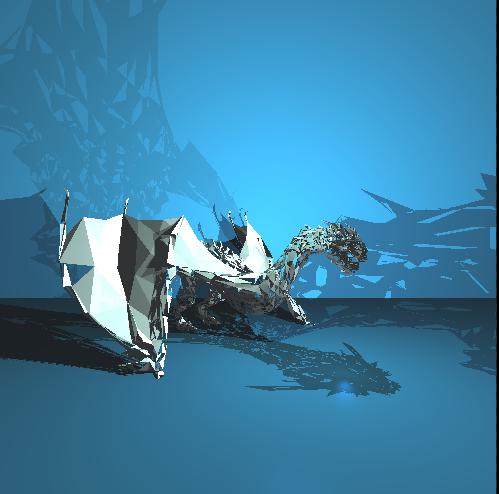
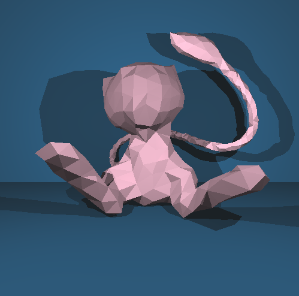

# MiniRT
The miniRT project involves creating a raytracer that models images based on a defined scene description in *.rt format. The program must use the MinilibX library to render a window displaying geometric objects (at least three types: plane, sphere, cylinder) with appropriate lighting effects, including ambient and diffuse lighting.

### Key features
- Proper window management (smooth transitions, minimization, resizing).
- Correct handling of object transformations (translation and rotation, except for spheres and lights).
- Handling of object properties such as diameter for spheres and height/length for cylinders.
- User interactions to close the program using the ESC key or the window's close button.

The scene description must adhere to specific formatting rules, with elements defined uniquely and able to appear in any order. The program should gracefully handle file operations and display the rendered scene efficiently.





## Installation
Clone the repository.

To perform the initial setup of the project, you can run the following commands:

```bash
make
```
To run the program, you need to execute the following command line(You can test it with all the files in the 'scene/' directory):
```bash
./miniRT scenes/cyl.rt
```
To perform the bonus setup of the project, you can run the following commands:

```bash
make bonus
```
To run the program, you need to execute the following command line(You can test it with all the files in the 'scene/bonus/' directory):
```bash
./miniRT_bonus scenes/bonus/cyl.rt
```


